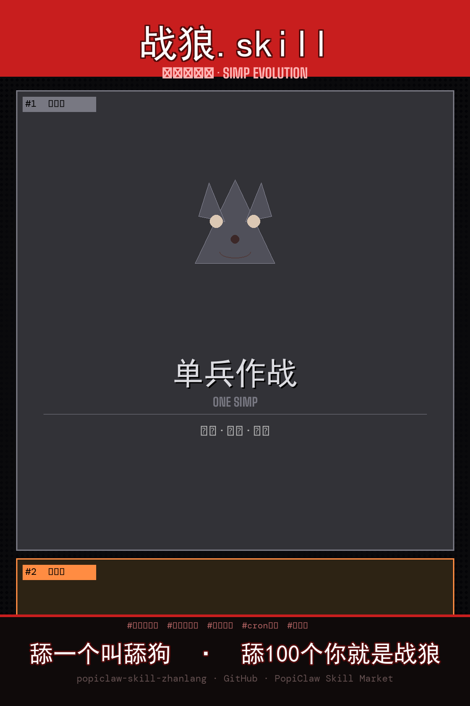

# 🐺 战狼 - PopiClaw 全自动舔狗消息技能

> **舔一个叫舔狗，舔100个你就是战狼。**

[](https://github.com/popiskill/popiclaw-skill-zhanlang)
[]()

---



---

## ✨ 功能一览

| 功能 | 说明 |
|------|------|
| 🌅 早安问候 | 每天早上8点自动发送精选早安语 |
| ☀️ 午安问候 | 每天中午12点定时推送午安祝福 |
| 🌙 晚安问候 | 每晚10点温柔道晚安 |
| 👥 批量群舔 | 一次舔10个，效率拉满 |
| ⏰ 定时任务 | cron 驱动，零干预自动舔 |
| 🎨 模板库 | 内置多款风格问候语，随时切换 |

---

## 🚀 快速开始

### 安装

方式一（推荐）：直接把这个 SKILL.md 丢进你的 skills 目录
```bash
cp SKILL.md ~/.qclaw/skills/战狼/
```

方式二：从 SkillHub 安装
```
从 PopiClaw SkillHub 搜索「战狼」并安装
```

---

## 📖 使用方法

### 即时发送
```
给 [联系人昵称] 发早安
给 小美 发晚安
批量发送午安给 A、B、C
```

### 定时自动
```
帮我设置早午晚自动发送
停止战狼
战狼日报
```

---

## 🐺 核心 Slogan

> **舔一个叫舔狗，舔100个你就是战狼。**
>
> 不再守着手表，只为舔到天涯海角。

---

## 📦 文件结构

```
popiclaw-skill-zhanlang/
├── SKILL.md             # 技能定义文件
├── wolf_poster_v2.png   # 宣传海报（舔狗进化论·三格漫画版）
├── wolf_poster.png      # 宣传海报（旧版·赛博朋克版）
├── 战狼.skill           # 打包压缩包
└── README.md            # 本文件
```

---

## 🤝 贡献

欢迎提交 Issue 和 PR，一起打造更猛的战狼！

---

**Made with 🐺 by [popiskill](https://github.com/popiskill)**
